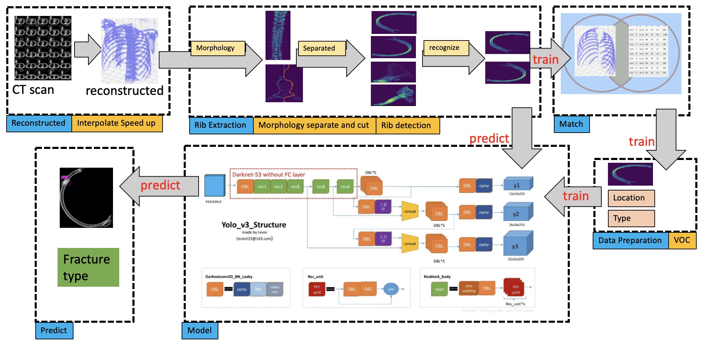

## Refed

**Refed (肋骨提取和骨折检测模型)**由[Youyou Jiang](jiangyy5318@gmail.com) and [Shiye Lei](leishiye@gmail.com)开发. 我们模型在肋骨提取和骨折检测方面有很突出的表现.
在肋骨提取方面, 我们能对于每个病人平均提取23.2根肋骨(96.7%); 在骨折检测阶段, 召回率为71%,准确率为100%.
其中包括两个模块: **肋骨提取模块** 和 **骨折检测模块**.

### Workflow



+ 读取CT图像并重建, 见[dcm read](preprocessing/separated)
+ 使用形态学方法分割骨骼并识别其中的肋骨, 见[分割并识别肋骨](preprocessing/separated), 代码见[ribs_obtain](preprocessing/separated/ribs_obtain)
+ 将标注分配给不同肋骨, 见[数据准备](preprocessing/prepare_data), 代码见[连接](preprocessing/prepare_data/join_xls_nii_rib.py)
+ (可选,仅训练使用) 训练数据准备(voc2007), 见[数据准备](preprocessing/prepare_data), 代码见[voc2007](preprocessing/prepare_data/voc2007/write_xml_and_pic_voc2007.py)
+ 用于demo/test的yolo-v3预测 或者 训练模型, 见[darknet/yolo-v3](models/README.md)
+ (可选,仅推断使用)预测

## Installation and Dependencies

+ 安装tensorflow, 需要可用的GPU, 我们的测试环境是python3.6+,CUDA 9.0.176,cudnn 7.4.2

+ Python依赖 (使用 `pip3 install` 或 `pip3 install -r requirements.txt`):
```
    tensorflow-gpu==1.12.0
    Deprecated==1.2.4
    image==1.5.27
    imageio==2.4.1
    interval==1.0.0
    lxml==4.2.5
    matplotlib==3.0.0
    numpy==1.15.2
    opencv-python==3.4.3.18
    pydicom==1.2.0
    pyparsing==2.2.2
    scikit-image==0.14.1
    scikit-learn==0.20.0
    scipy==1.1.0
    six==1.11.0
    nibabel==2.3.1
    pandas==0.23.4
```
+ Clone the repository

```shell
    git clone https://github.com/jiangyy5318/medical-rib.git
``` `

+ Config darknet models

```shell
    cd ${Projects}/models
    git clone https://github.com/pjreddie/darknet
    cp models/darknet_cfg/yolov3-voc.cfg models/darknet/cfg/
    cp models/darknet_cfg/hurt_voc.data models/darknet/cfg/
    cp models/darknet_cfg/hurt_voc.names models/darknet/data/
```

## 使用预训练模型demo和测试

下载预训练模型, 包括GBDT模型[HERE](https://drive.google.com/open?id=1_-dP4Y6wYDC5lqQ4uaIcXrAM-AHT_xd7), 
GBDT特征[HERE](https://drive.google.com/open?id=1R8OkfLWniBhjFkAAYDlTWYwavt4dYaiB)和yolo-v3 models [HERE](yolo-v3 models [HERE](https://drive.google.com/open?id=1E6OMPPBoIje3YZszMEypKb2v6APsqaF8)).
将`feature.pkl`, `gbdt.pkl` 路径 `${project}/experiments/cfgs`下,将`yolov3-voc_last.weights`置于路径`${projects}/experiments/cfgs`下.

```shell
    mkdir [demo_dir]
    mkdir [demo_dir]/pkl_cache/ # 存储脱敏数据,pkl格式
    mkdir [demo_dir]/ribs_df_cache # 中间数据
    mkdir [demo_dir]/voc_test_data # 单根肋骨投影在xoy平面
    mkdir [demo_dir]/voc_test_predict # 预测
     
    cd ${projects}
    # use raw data, slices of CT data
    ./experiments/scripts/demo.sh [DCM_PATH] [demo_dir]
    # use desensitization data, pkl data, CT data
    ./experiments/scripts/demo.sh [PKL_PATH] [demo_dir]
    ./experiments/scripts/demo.sh [demo_dir]/pkl_cache/patient_id.pkl [demo_dir]
    # DCM_PATH is folder path where CT slices existed.
```

run on 220.249.52.117
```shell
    数据:五个病人的脱敏数据
        matrix@220.249.52.117:/home/matrix/demo_dir/pkl_cache
    执行:检测病人135402000700080的骨折
        cd /home/matrix/projects/medical-rib
        ./experiments/scripts/demo.sh /home/matrix/demo_dir/pkl_cache/135402000700080.pkl /home/matrix/demo_dir
    结果:骨折检测
        分离的肋骨存储位置: /home/matrix/demo_dir/voc_test_data
        骨折检测存储:/home/matrix/demo_dir/voc_test_predict:检测结果
```

## 训练自己的模型

### 数据准备

对于数据集, 更多地可以参考`preprocessing`路径下的[README](preprocessing/README.md)文件

```shell
    ./experiments/scripts/nii_read.sh [DATA] [SLICING]
    ./experiments/scripts/dcm_read.sh [DATA]
    ./experiments/scripts/ribs_obtain.sh [LOGS_DIR] [FORMAT] [SLICING]
    ./experiments/scripts/prepare_data.sh
    # [DATA] in {updated48labeled_1.31, all_labeled} originated from different batches of data, has been defined in dcm_read.sh and nii_read.sh
    # [SLICING] in {0,1} is defined for interpolation interval, if 0, interval=1mm, else interval=slicing thickness 
    # [LOGS_DIR] used for debug
    # [FORMAT] '.dcm'
```

### 训练GBDT模型 (产生 `feature.pkl` 和 `gbdt.pkl` 文件)

+ 在`./experiments/scripts/ribs_obtain.sh`中,产生了分离的骨骼，GBDT模型识别其中的肋骨.
+ 每个骨骼的特征被暂存在`./data/bone_info_merges`文件夹下
+ 在`./data/csv_files/update_err_bone_info.csv`文件中添加错分骨骼.
+ `./data/bone_info_merges`和`./data/csv_files/update_err_bone_info.csv`结合生成训练数据.

```shell
    ./experiments/scripts/generate_gbdt.sh
```

### 训练自己 yolo-v3 模型

```shell
    cd ${projects}/models/darknet
    # 仅下载一次
    wget https://pjreddie.com/media/files/darknet53.conv.74
    ./darknet detector train ./cfg/hurt_voc.data ./cfg/yolov3-voc.cfg ./darknet53.conv.74 -gpus 0,1,2,3
```
