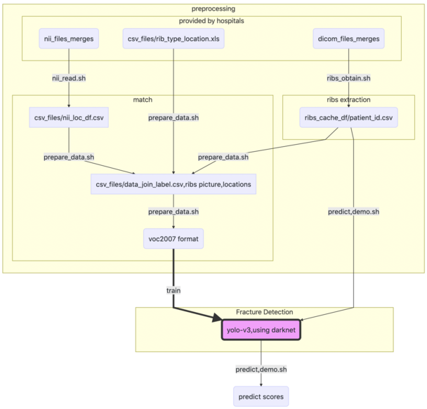

### DataSet structure
Our rawdata has many batches, which come from so many differents hospitals. So We have strictly defined the file structures and data format from scratch. 

```
data
└───csv_files
│       offset_df.csv
│       rib_type_location.xls    
│       nii_loc_df.csv
│       label_loc_type_info.csv    
│       join_label.csv
│ 
└───dicom_files_merges
│   └───patient001
│   │       file111.dcm
│   │       file112.dcm
│   │       ...
│   │
│   └───patient002
│           ...
│
└───nii_files_merges
│   └───patient001
│   │       file111.nii
│   │       file112.nii
│   │       ...
│   └───patient002
│           ...
│
└───ribs_df_cache
│       patient001.csv
│       patient002.csv
│       ...
│
└───bone_info_merges
│       patient001.csv
│       patient002.csv
|       ...
|
└───voc2007
        train.txt
        2007_test.txt
        Annotations
        ImageSets
        JPEGImages
        labels
```

Among all the folders and files, `dicom_files_merges`, `nii_files_merges`, `csv_files/rib_type_location.xls ` are provided by hospitals. the remaining are generated by our algorithms, There are many detailed descriptions for them as belows
+ **dicom_files_merges**: store many folders of CT images, every folder stand for a CT images of a patient.
+ **nii_files_merges**: All the fragmented location have been labeled, every .nii file stands for one or more fragmented location on one rib.
+ **bone_info_merges**: record every bones' feature and predicted score(rib or not), we can update some err predicted labels in order to expand gbdt dataset.
+ **rib_df_cache**: ribs belonging to one patient collected in `patient_id.csv`, whose columns has `x,y,z,c,v`(c is bone id, v is hu)
+ **csv_files/rib_type_location.xls**: rib fragmented type related to locations of patient in the **nii_files_merges** will be shown in the **rib_type_location.xls**.
+ **csv_files/nii_loc_df.csv**: 3d bounding-box coordinates for every fragmented locations.
+ **csv_files/join_label.csv**:join between ribs and fragmented locations, we can get the relationship between them. There are at least one rib for a fragmented location, but the opposite is not necessary.
+ **csv_files/offset_df.csv**: used for transforming rib sparse data to local picture.

### dataflow

```
graph TB
    subgraph preprocessing
        subgraph provided by hospitals
            A(dicom_files_merges)
            D(nii_files_merges)
            E(csv_files/rib_type_location.xls)
        end
        
        subgraph ribs extraction
            A --> |ribs_obtain.sh| B(ribs_cache_df/patient_id.csv)
        end

        subgraph match
            B --> |prepare_data.sh|H[csv_files/data_join_label.csv,ribs picture,locations]
            D --> |nii_read.sh|F[csv_files/nii_loc_df.csv]
            E --> |prepare_data.sh|H
            F --> |prepare_data.sh|H
            H --> |prepare_data.sh|J(voc2007 format)
        end
    end

    subgraph Fracture Detection
        J ==train==> K(yolo-v3,using darknet)
        style K fill:#f9f,stroke:#333,stroke-width:4px
        B -->|predict,demo.sh|K
    end
    
    K -->|predict,demo.sh|L(predict scores)
```


