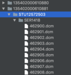
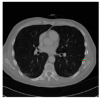
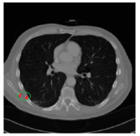

### 0. 肋骨骨折数据及标注方法
肋骨骨折数据及标注主要包括以下三个部分:
- 原始CT数据
- 骨折区域标注文件
- 关联文件

交付文件的文件结构也是三部分的一一对应:

- **dataset**:数据集,存储CT原始数据 
  - 135402000150175
    - 30340.dcm
    - 30341.dcm
    - 30342.dcm
    - ...
    - 30734.dcm
  - 135402000555091
  - ...
- **label**:标注集,存储每个CT若干肋骨的骨折信息
  - 135402000150175
    - 135402000150175-L6.nii
    - 135402000150175-L11.nii
    - 135402000150175-R5.nii
  - 35402000555091
  - ...
- **关联文件.xlsx**

**notes**:*之前文件名“fudan-huadong-”字样, 为什么要去掉之前的“fudan-huadong-”字样, 因为之前的标注237个标注病人中,出现了两种情况: 1.部分标注样本加了“fudan-huadong-”字样; 2. 一些标注中只有dcm、nii、excel中一个或两个加了“fudan-huadong-”字样。为了避免加这些字样导致不必要的错误,故将这部分字样去掉。*

其中, 

`$dataset$`文件夹用来存CT原始数据(由一系列`$.dcm$`文件组成), 每个CT原始数据存储在`$dataset$`目录下特定的子文件内,子文件的命名为**病人ID**, 如上面的**dataset->135402000150175**。

**notes**:*这里,假设每个人只有一个CT,如果某个人有两个CT,只选取其中一个作为样本并对其进行标注, 这样patient ID 就可以作为唯一值来简历dataset、excel、label的联系*

`$label$`文件用来存储标注数据。每根**存在骨折**的肋骨对应一个标注文件(.nii文件), 文件按照“病人ID(Patient ID)+位置”来命名，比如“135402000150175-L6.nii”。这些标注文件存储在`$label$`目录下对应子文件夹(按照病人ID命名)内。

`$\text{关联文件}.xlsx$`文件用来将`$dataset$`的CT映像和`$label$`中的标注文件关联起来, 并且指明每个骨折位置的骨折类型

---

### 1. 原始数据(dcm文件)

`$dataset$`中的每个子文件夹存储着原始CT的系列.dcm文件, 如下图:

---

### 2. 骨折区域标注(标注文件):

##### 2.1 对于某个肋骨的某一处骨折如何进行标注

比如135402000150175左边第6根肋骨存在骨折,135402000150175-L6.nii”文件如何生成?我们这里使用**slicer**软件进行标注,slicer能够在CT的横断位数据中对于骨折区域进行勾勒, 勾勒完成之后能够导出我们需要的`$.nii$`文件。

- **2.1.1** 对于骨折区域如何勾勒的说明:

**举例说明**, 如下图,某个肋骨的**某个横断位影像**在红色位置处存在骨折,则使用画笔工具对于骨折位置进行勾勒, 勾勒的形状**尽可能**刚好包围整个骨折位置, 然后在勾勒区域内填充。另外，骨折区域可能存在于连续的**多层横断位**影像中, 对于存在骨折的多层影像**都**需要进行勾勒。对于这根肋骨所有骨折区域勾勒完成之后, 导出`$.nii$`文件
 
**为什么对存在骨折的每个横断位影像都要进行标注**:*1. 进行骨折位置检测,需要知道骨折位置的包围盒,即x,y,z三个方向的边界, slicing能够反映z方向的边界；2.一根肋骨上有可能有两处及以上骨折, 每根肋骨的标注文件就会有多处连通区域 如果一处骨折中某个slicing没有标注，原本的的一处连通区域就会变为两处或多处，这样就会将一处骨折标注为两处甚至多处*

- **2.1.2** 准确的勾勒骨折位置的==重要性==
  
骨折位置标注不只需要标注出CT**哪个位置出现骨折**, 而且需要**准确地标注出骨折区域**。在上一批的标注文件中出现了多种标注骨折区域不符的情况:1.超过骨折区域; 2.小于骨折区域; 3.偏离骨折区域。

##### 2.2 一根肋骨多处骨折
一根肋骨上有可能存在不止一处骨折,对于某根肋骨的**所有骨折**都要进行标注, 不能只标一处。在调整标注过程中，发现很多肋骨上存在两处以上的骨折, 但是标注文件中只体现了其中一个的情况。

**notes**:*骨折区域勾勒不准或者骨折漏标,不止影响训练的模型, 而且影响指标评价*

##### 2.3 关于骨折标注文件命名
某个CT文件存在多根肋骨骨折,分别是L3、L4、L5、L6, 则命名如下图。

---

### 3. 关联文件
上面分别叙述了一个CT的原始CT数据和CT的骨折区域如何标注。关联文件通过Excel将这两者关联起来, 并指明每个骨折位置的骨折类型，如下表所示:

原始数据 | 标注数据 | 骨折类型 | 骨折位置个数 | 备注
---|---|---|---|---
135402000150175 | 135402000150175-L6 | 断端错误 | 2 |
135402000150175 | 135402000150175-L11 | 前肋线性骨折 | 1 |
135402000150175 | 135402000150175-R5 | 未知骨折;新骨折类型 | 2 |
135402000555091 | 135402000555091-L3 | 新骨折类型 | 1 |某某新骨折类型
135402000555091 | 135402000555091-L4 | 断端错误 | 2 |

其中骨折类型一栏包括:断端错误,错位,前肋线性骨折,陈旧性骨折,不全性骨折,骨折伴骨痂。
- 以上列了部分骨折类型但不是骨折的所有类型, 如果存在新的骨折类型,可以在骨折类型一栏填写“**新骨折类型**”,备注栏填写具体骨折类型, 数据处理时, 会做特殊处理并且修改本文件增加骨折类型;
- 对于如果确认是骨折但不能确认其骨折类型的可以使用“**未知骨折**”代替,骨折类型是本项目学习的目标之一, 尽可能减少“**未知骨折**”名词的使用。
- 如果一根肋骨存在多处骨折但骨折类型都相同,则骨折类型只填一种;
- 如果一根肋骨存在多处骨折但骨折类型不同, 骨折类型则按照在slicing中出现的==顺序==来填写,以分号";"间隔。

### 4. 标注的一些原则
- 为了避免漏标、错标、区域不准等问题,每一个CT文件都需要经过两个人标注:
  - 两人独立标注;
  - 一起比对,对于每一处骨折达成共识;
  - 输出新的骨折标注文件。

### 5. 文件上需要注意的一些问题
- excel和标注文件不一致,主要体现在以下几个方面:
  - excel上声明, 标注文件找不到;
  - excel上没有声明, 但有标注文件;
  - 将原始CT文件直接转化为nii保存在标注文件中;
- excel的问题:
  - 重复,某个病人被标注两次;
  - excel未对齐, 多处错行、错列;
- 和原始CT文件的不一致:
  - 没有CT文件, 但有标注文件;
  - 没有CT文件, 但在excel上声明;
  - A 标注对应 B CT 源文件;
- 标注文件问题:
  - nii空文件, 只有几百K
  - 一些很奇怪的命名
 

